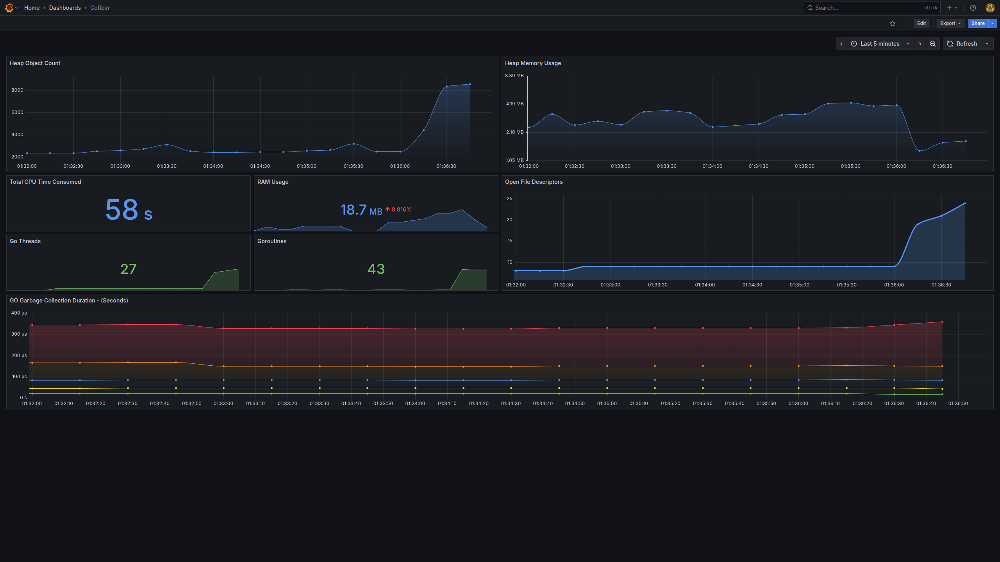

# 📊 gofiber-metrics

A minimal example of exposing Prometheus-compatible metrics in a GoFiber application. Includes a sample Grafana dashboard for visualizing metrics.

## 🚀 Getting Started

This project creates a `/metrics` endpoint to be scraped by Prometheus and visualized using Grafana.

---

### 📁 `main.go`

```go
package main

import (
  "github.com/gofiber/fiber/v2"
  "github.com/gofiber/fiber/v2/middleware/adaptor"
  "github.com/prometheus/client_golang/prometheus/promhttp"
)

func main() {
  app := fiber.New()
  app.Get("/metrics", adaptor.HTTPHandler(promhttp.Handler()))

  app.Listen(":8080")
}
```

* The Prometheus HTTP handler is adapted for Fiber using adaptor.HTTPHandler.


### ⚙️ prometheus.yml
```yml
global:
  scrape_interval: 15s
scrape_configs:
  - job_name: 'gofiber_app'
    metrics_path: /metrics
    static_configs:
    - targets: ['localhost:8080']
```

* Prometheus will scrape metrics from localhost:8080/metrics every 15 seconds.

### 📈 Grafana Dashboard
1-) Open Grafana.

2-) Go to Dashboards > New > Import.

3-) Upload the grafana-dashboard.json file or paste its content.

4-) Select your Prometheus data source and import.

### 🖼️ Dashboard Screenshot

